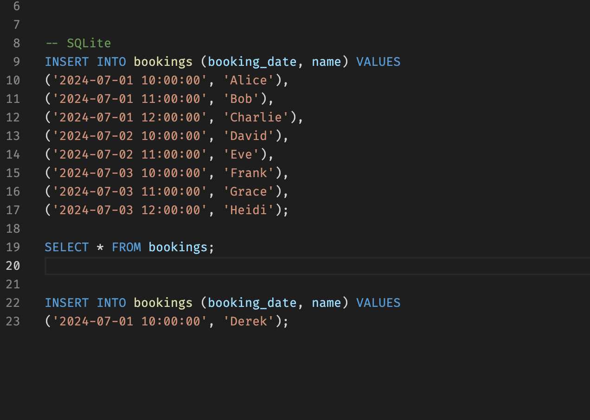

# React + TypeScript + Vite

# Prerequisites

- Node.js (v18 or later)
- pnpm (v9 or later)
- opttional: Corepack

# Getting Started

## Create schema

```bash
pnpm run create:schema
```

## Run the applications

```bash
pnpm install
pnpm run dev
```

# Thoughts and prayers

## Choice of stack

### Frontend

- React: Popular and well-supported front-end library. Also comforable with it.
- TypeScript: I like using typescript over js any day. Aso it's popular.
- Vite: as my bundeler it has tree-shaking like the others but it's not a paint to configure. Also i like using vitest for testing if i add testing.
- pnpm: I like pnpm over npm and yarn because of its speed and easier workspace support.
- Turborepo: Using it because it was mentioned and i used a little bit of it before when finding a replacement for lerna.
- swc: Maybe i might use it a bit over kill for the project.

### Backend

- Fastify: What i am comfortable with as i use it for work. Its faster only because of how it parses json.
- TypeScript: Same reason as frontend.
- pnpm: Same reason as frontend.
- Turborepo: Same reason as frontend.
- ts-node: I like using ts-node for small projects to avoid the build step. Proper project i'll use tsc to compile or a bundler like esbuild or rollup.
- sqlite3: Lightweight database that requires no setup. Perfect for this small project.

## Setting up simple schema

- Created 2 tables bookings and temp_bookings.
- bookings table is the main table that stores the booking date and user name.
- temp_bookings table just an idea i had to store the booking request temporarily. might no necessarily need it.
- bookings table has a unique constraint on the booking_date to prevent double booking. Simple way to do it.

## Test drive schema

Testing the queries and unique constraint manual query.


## sqlite3, sqlite issues

I was unable to run those libraries due to binding issues related to my M1 Mac. so i ended up using sql.js the most pure client side sqlite implementation.

## adding schema validation
